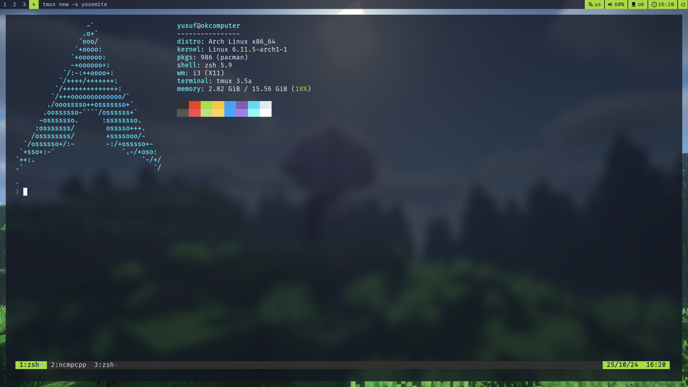

# yosa12978 dotfiles



## Installing dependencies

### Arch Linux

(You can use basically any linux distro but since I mainly use Arch linux on desktop I wrote commands only for Arch)

Basic packages

```bash
sudo pacman -S zsh alacritty neovim stow brightnessctl alsa-utils fastfetch ly tmux fzf bat tealdeer
sudo systemctl enable ly # enabling ly login manager (https://github.com/fairyglade/ly)
```

Install i3 dependencies

```bash
sudo pacman -S i3-wm dmenu polybar picom xorg-xinput xautolock xorg-xauth nitrogen flameshot slock
```


After doing that install [oh-my-zsh](https://ohmyz.sh/#install)

```bash
sh -c "$(curl -fsSL https://raw.githubusercontent.com/ohmyzsh/ohmyzsh/master/tools/install.sh)"
```

## After installing dependencies

Clone this repo

```bash
git clone https://github.com/yosa12978/dotfiles.git
```

goto ```dotfiles``` directory and use

```bash
stow --adopt .
git restore .
```

*** Warning: This command will delete your same dotfiles directories and replace them with symlinks ***


To update dotfiles use ```stow .```

You can use dotfiles without stow. Just replace files you want to use in your .config dir with mine 
