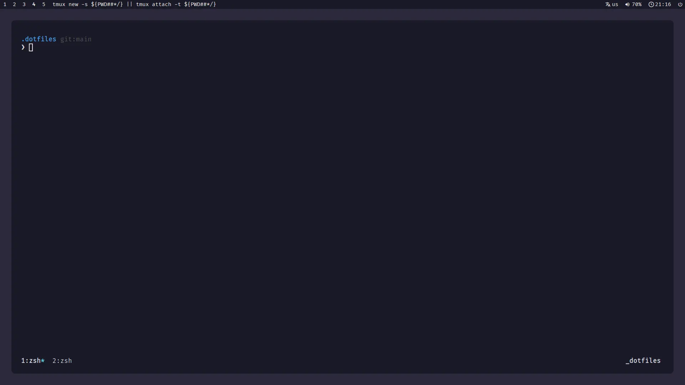

# My dotfiles



## Installing dependencies

### Arch Linux

```bash
# basic packages
sudo pacman -S zsh alacritty neovim stow brightnessctl alsa-utils fastfetch ly tmux fzf bat tealdeer sxhkd

# enable ly login manager
sudo systemctl enable ly

# i3 dependencies
sudo pacman -S i3-wm dmenu polybar picom xorg-xinput xautolock xorg-xauth nitrogen flameshot slock

# i also have a dwm build
git clone github.com/yosa12978/dwm.git ~/.local/src/dwm

# oh-my-zsh
sh -c "$(curl -fsSL https://raw.githubusercontent.com/ohmyzsh/ohmyzsh/master/tools/install.sh)"
```

## Installing dotfiles

Clone this repo and replace your configs with my dotfiles

```bash
git clone https://github.com/yosa12978/dotfiles.git ~/.dotfiles
cd ~/.dotfiles
stow --adopt .
git restore .
```
